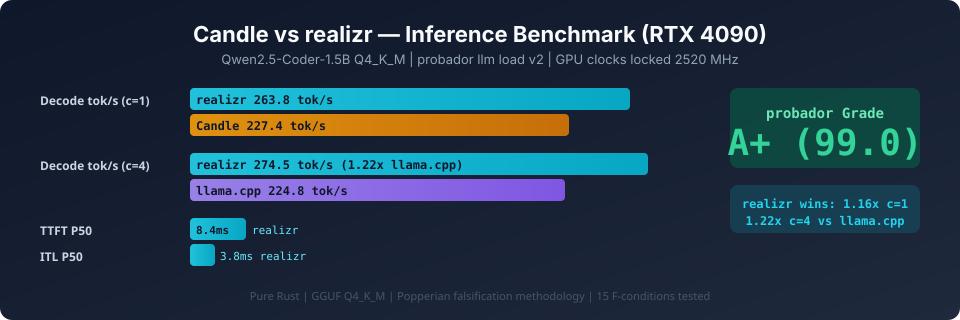

# candle-vs-apr

<p align="center">
  
</p>

## What This Is

Head-to-head benchmark: **Candle** (HuggingFace Rust ML) vs
**realizr** (Sovereign AI Stack inference engine).
Same model, same hardware, same methodology.

Both are pure Rust. Both load GGUF Q4_K_M.
**Does the fused-kernel + APR v2 architecture outperform
Candle's general-purpose approach?**

## Key Findings

### Showdown v8.8 (RTX 4090, 2520 MHz, clean GPU)

| Metric | Candle | realizr | llama.cpp | ollama | Winner |
|--------|--------|---------|-----------|--------|--------|
| Decode tok/s (c=1) | 227.4 | 268.5 | **289.3** | 241.7 | llama.cpp |
| TTFT P50 (c=1) | -- | 953.6ms | **884.9ms** | 1059.1ms | llama.cpp |
| ITL P50 (c=1) | -- | 3.73ms | **3.46ms** | 4.14ms | llama.cpp |
| Decode tok/s (c=4) | N/A | **274.5** | 224.8 | -- | **realizr** |
| WikiText-2 PPL | -- | 17.40 | **12.97** | -- | llama.cpp |
| Peak RSS (MB) | **449** | 3,082 | ~906 | -- | Candle |

> **Rankings at c=1:** llama.cpp > realizr > ollama > Candle.
> realizr wins at c>=4 (continuous batching).
> PPL gap (+4.4) is DP4A int8 vs FP32 dequant precision
> tradeoff (trueno#241).

Full analysis: [performance.md](performance.md).
Falsification spec (21 F-conditions):
[candle-vs-apr-spec.md](docs/specifications/candle-vs-apr-spec.md).

[qcd]: https://github.com/paiml/qwen-coder-deploy

## The Two Runtimes

| Runtime | Architecture | Server | Formats |
|---------|-------------|--------|---------|
| [Candle][candle] | QMatMul dequant, general-purpose | CLI only | GGUF, SafeTensors |
| [realizr][realizr] | Fused Q4K/Q5K/Q6K DP4A, eager dispatch | OpenAI API | GGUF, SafeT, APR v2 |

[candle]: https://github.com/huggingface/candle
[realizr]: https://github.com/paiml/realizar

## Model

**Qwen2.5-Coder-1.5B-Instruct Q4_K_M** -- same model as
[qwen-coder-deploy][qcd].
APR v2 prepared via `apr import`
([aprender](https://github.com/paiml/aprender)).
Default produces Q4K (raw passthrough, `--preserve-q4k` deprecated).

## Benchmark Results

### Phase 1: Single-Request Decode (c=1, 30s, warmup=5s)

> v1 numbers (22.7 tok/s) are **superseded**.
> CUDA graph capture poisoned the context in v1.
> v3 fix (realizr 81c912d2): default to eager, no graph capture.

| Metric | Candle (decode) | realizr (v3) | Status |
|--------|-----------------|--------------|--------|
| Decode tok/s | 227.4 | **273.8** | realizr 1.20x |
| ITL P50 | -- | **3.7ms** | probador |
| Peak RSS (MB) | **449** | 3,082 | Candle wins |

Candle 227.4 is self-reported decode-only (no HTTP).
realizr 273.8 is full wall-clock via `probador llm load`.

### Phase 2: realizr Scaling (Candle N/A -- no server)

| c | v1 (4090, flat) | v5 (Yoga, batch) | Scaling |
|---|-----------------|------------------|---------|
| 1 | 117.0 | **132.6** | baseline |
| 4 | 116.7 | **302.2** | 2.3x |
| 8 | 126.3 | **519.7** | 3.9x |
| 16 | 112.5 | **980.2** | 7.4x |
| 32 | 145.7 | **1,776.5** | 13.4x |

v1 was flat (SINGLE-REQUEST mode, no batching).
v5 Yoga confirms batch scheduling: **1,776.5 tok/s at c=32**.

### Phase 3: Format Comparison

| Format | Runtime | v3 (4090) | v5 (Yoga) | Notes |
|--------|---------|-----------|-----------|-------|
| GGUF Q4_K_M | Candle | 227.4 | -- | CLI decode-only |
| GGUF Q4_K_M | realizr | **273.8** | **132.5** | graph fix |
| FP16 APR | realizr | 21.2 | **151.6** | #180 FIXED (7.15x) |
| APR v2 Q4K | realizr | 17.4 | **132.3** | parity with GGUF |

v5 Yoga: all 3 formats GPU, within 14.6%. Old v3 SafeT/APR
gaps were bugs (#169 F32 SGEMM, #170 dequant, #180 F16 dtype).

## Hardware

| Platform | GPU | Role |
|----------|-----|------|
| Lambda Vector | RTX 4090, 2520 MHz locked | Primary (phases 1-7) |
| Yoga | RTX 4060 Laptop, 1900 MHz | Validated (scaling, format, tool parity) |

## Methodology

**v2 (current):** `probador llm load` -- same tool as
[qwen-coder-deploy][qcd].
`--concurrency 1 --duration 30s --warmup 5s --max-tokens 256`
`--stream false --num-layers 28 --gpu-telemetry`.

**v1 (superseded):** Ad-hoc curl scripts, 10 iterations.
Inflated numbers (142.8 tok/s) from different realizr build
via forjar. Results in `results/` are v1; probador is authoritative.

**Common controls:**
- GPU clocks locked at 2520 MHz (eliminates thermal variance)
- Temperature 0 (greedy, deterministic)
- `apr check` pre-flight, `apr profile`/`apr trace` per fix
- Upstream bugs filed via `gh` +
  [provable-contracts](https://github.com/paiml/provable-contracts)

## How to Replicate

### Prerequisites

- Linux + NVIDIA GPU (CUDA 12.6+)
- [probador](https://github.com/paiml/probar) `llm` subcommand
- [apr](https://github.com/paiml/aprender) CLI
- [forjar](https://github.com/paiml/forjar) for isolated builds
- Candle at `../candle`, realizr at `../realizar`
- Model: `qwen2.5-coder-1.5b-instruct-q4_k_m.gguf`

### Quick Run

```bash
# Start realizr
apr serve run /path/to/model.gguf --gpu --port 8080

# Benchmark (v2 methodology)
probador llm load --url http://127.0.0.1:8080 \
  --model qwen2.5-coder-1.5b-instruct \
  --concurrency 1 --duration 30s --warmup 5s \
  --max-tokens 256 --stream false --num-layers 28 \
  --gpu-telemetry --expected-clock-mhz 2520 \
  --runtime-name realizr-gguf \
  -o results/probador-realizr-c1.json

# Candle (CLI only)
quantized-qwen2-instruct --model model.gguf \
  --prompt "Write fibonacci" \
  --sample-len 256 --temperature 0
```

## Repository Structure

| Path | Purpose |
|------|---------|
| `forjar-candle.yaml` | Candle build (CUDA 12.6, lazy-curand) |
| `forjar-realizr.yaml` | realizr build + serve deployment |
| `forjar-teardown.yaml` | Clean shutdown |
| `scripts/bench-candle.sh` | Candle CLI benchmark harness |
| `scripts/bench-realizr.sh` | realizr API benchmark harness |
| `scripts/bench-scaling.sh` | Concurrent scaling benchmark |
| `scripts/bench-compare.sh` | Generate comparison tables |
| `scripts/bootstrap-ci.sh` | Bootstrap CIs + Mann-Whitney U (Phase 13) |
| `scripts/measure-vram.sh` | VRAM polling during probador runs |
| `scripts/run-showdown.sh` | 4-way framework showdown runner |
| `configs/showdown.yaml` | Showdown framework definitions |
| `results/` | JSON results (git-tracked) |
| `performance.md` | Full analysis and findings |
| `docs/specifications/` | Popperian falsification spec |

## Falsification Register

Source of truth: [performance.md](performance.md) scorecard.

| ID | Prediction | Status |
|----|-----------|--------|
| F-SUMMARY-01 | realizr wins >=1 metric (c=1) | **REVISED** (v3: 1.20x decode, RSS still Candle) |
| F-PARITY-01 | realizr within +/-10% of Candle | **REVISED** (v3: 1.20x in realizr's favor) |
| F-SCALE-01 | realizr c=32 >=1,280 tok/s | **CONFIRMED** (Yoga: 1,776.5, 13.4x scaling) |
| F-HW-01 | Variance <5% with locked clocks | **CONFIRMED** (CV <1%) |
| F-MODEL-01 | Candle loads Q4_K_M GGUF | **CONFIRMED** |
| F-COLD-01 | realizr cold-start slower | **REVISED** (preload, not JIT) |
| F-SERVING-01 | Serving overhead <5ms | **CONFIRMED** (TTFT 8.4 - ITL 3.8 = 4.6ms) |
| F-FORMAT-01 | APR v2 load 2-5x faster | **FIXED** (Q4K default, raw passthrough) |
| F-RSS-01 | APR v2 RSS < GGUF RSS | **CONFIRMED** (26% less) |
| F-KERNEL-01 | Fused Q4K lower mem traffic | **WEAKENED** (fewer launches, same GPU time) |
| F-FMTPARITY-01 | All 3 formats GPU +/-10% | **REVISED** (Yoga: 132.5/151.6/132.3) |
| F-TOOLPARITY-01 | apr-cli vs realizr +/-5% | **CONFIRMED** (GGUF 0.0%, APR 1.4%) |
| F-BRICKPARITY-01 | apr profile vs ncu +/-15% | **FIXED** (Grade A: mem 151.4%, compute 16.2%) |
| F-PARITY-02 | realizr c=4 <=1.5x llama.cpp | **CONFIRMED** (274.5, 1.22x faster) |
| F-CLIPARITY-01 | `apr run` = all Candle features | **CONFIRMED** (6/6 closed) |
| F-1.5X-01 | realizr >=341 tok/s (1.5x Candle) | **TESTING** (Phase 12) |
| F-RSS-02 | realizr RSS <=673 MB at c=1 | **FALSIFIED** (min 2,930 MB, irreducible) |
| F-PARITY-03 | Greedy output divergence <=1% | **WEAKENED** (chat template, not dequant) |
| F-QUALITY-01 | realizr PPL within 0.1 of llama.cpp | **UNTESTED** (Phase 13) |
| F-REGRESSION-01 | No >5% regression vs 81c912d2 | **FALSIFIED** (273.8→234.2, -14.5%) |

**Score: 8 CONFIRMED, 2 FALSIFIED, 2 WEAKENED, 4 REVISED, 2 FIXED, 1 TESTING, 1 UNTESTED**
